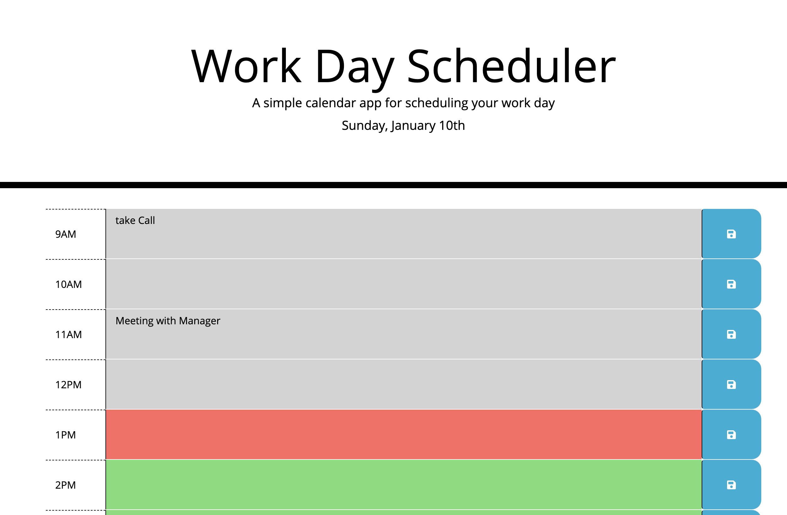
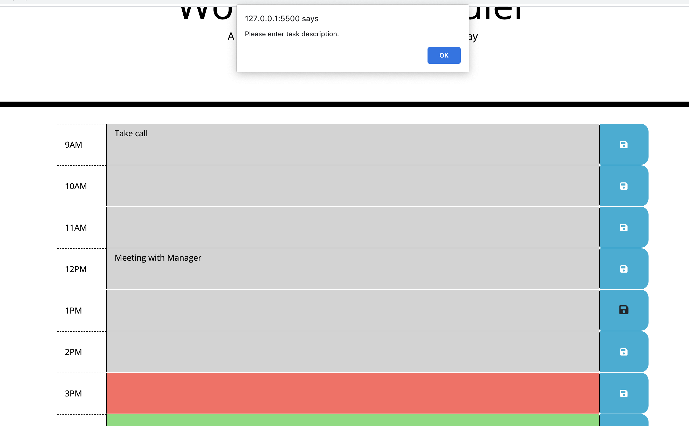
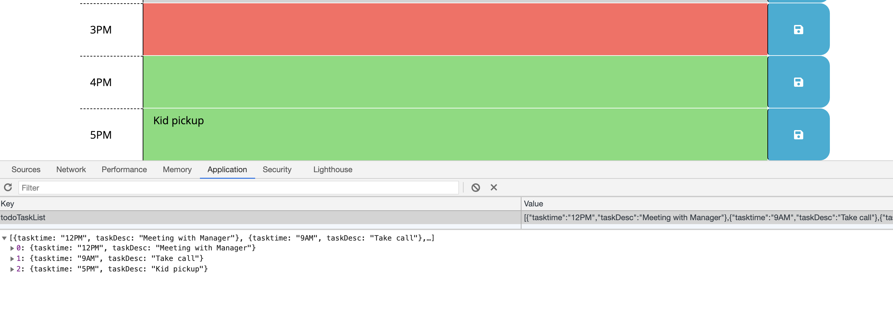

# Daily Planner
Daily Planner is hourly scheduler for your day. It will show you business hours for today's date and Description area in which user can enter todo task.

Current hour task will be display in RED , Past hours task will be in Gray and Future hours task will be displayed in Green color.
LocalStorage is used to store planner detail, which include hours and task description.

GitHub Detail -

It is uploaded in GitHub.

For clone the project use below options or you can download Zip file.

SSH "git@github.com:bhumisha/DailyPlanner.git" HTTPS :https://github.com/bhumisha/DailyPlanner.git

Project Source code : https://github.com/bhumisha/DailyPlanner

You can view and enter your daily schedular using below link https://bhumisha.github.io/DailyPlanner/

This project includes code with HTML,CSS and JQuery having used of moment(),JQuery and bootstrap third party libraries.
main logic is written in JQuery. Js file contains DOM manipulation, conditional statements / loop statement / validations to modularised code we have used functions. LocalStorage is also used to store daily plan schedular.

The following screen demonstrates the application functionality: Landing page / validation / localstorage 

